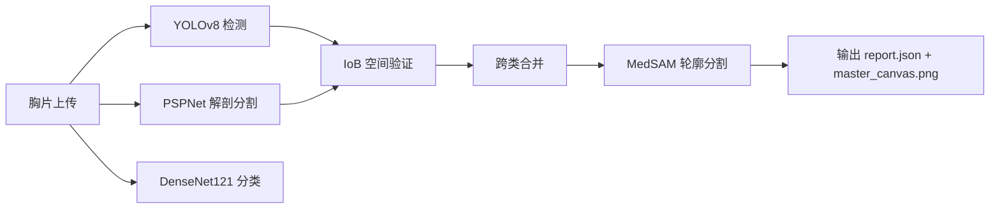
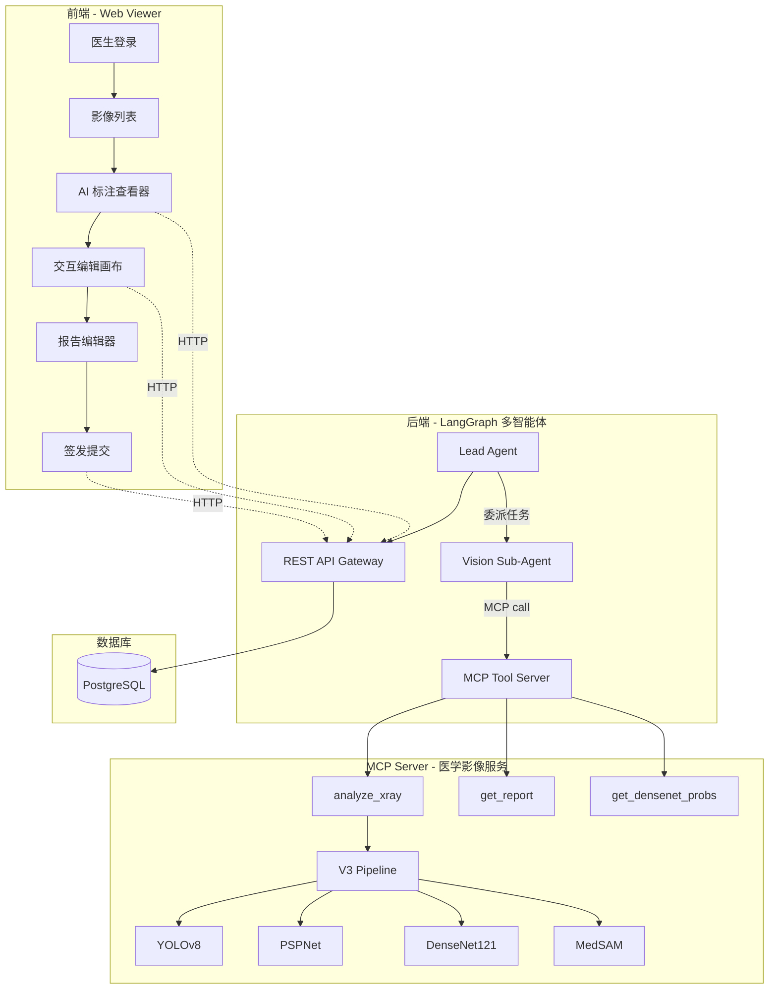

# AI 辅助胸片诊断系统 — Human-in-the-Loop 技术架构

> 本文档面向前端和后端开发人员，详细描述如何将当前 Pipeline V3 的 AI 推理能力包装成一个支持医生实时审核、修改、签发的完整产品。

---

## 一、当前 AI 引擎能力概览

### 1.1 技术栈

| 模型 | 作用 | 输入 | 输出 |
|------|------|------|------|
| **YOLOv8** (自训练, 86.7%准确率) | 病灶检测 | 原始胸片 (任意分辨率) | 14类病灶的 bbox 坐标 + 置信度 |
| **PSPNet** (TorchXRayVision内置) | 解剖分割 | 胸片 (512×512) | 14种解剖结构掩膜 (左/右肺、心脏等) |
| **DenseNet121** (预训练) | 疾病分类 | 胸片 (224×224) | 18种疾病全局概率 |
| **MedSAM** (可选) | 精细分割 | bbox 区域截图 | 病灶像素级轮廓蒙版 |

### 1.2 当前 V3 Pipeline 处理流程



### 1.3 当前输出格式 — [report.json](file:///e:/Dev_Workspace/01_Projects/Github_Project/torchxrayvision/torchxrayvision/test_output/pneumonia_test_v3/report.json)

```json
{
  "pipeline": "Pipeline V3",
  "summary": {
    "total_zones": 2,
    "total_findings": 3,
    "bilateral_diseases": ["Pulmonary_fibrosis"],
    "disease_breakdown": {
      "Pulmonary_fibrosis": {
        "count": 2, "bilateral": true,
        "distribution": "bilateral (2 foci)",
        "distribution_cn": "双肺多发 (2处)"
      }
    }
  },
  "lesion_zones": [
    {
      "zone_id": 1,
      "primary": "Nodule_Mass",
      "confidence": 0.838,
      "location": "Left middle zone, central zone",
      "location_cn": "左肺中野中带",
      "bbox": [649.9, 387.9, 831.4, 553.2],
      "concurrent": []
    }
  ],
  "rejected": [],
  "densenet_probs": {
    "Pneumonia": 0.608, "Mass": 0.567, "Nodule": 0.519
  }
}
```

---

## 二、HITL 系统总体架构

> [!IMPORTANT]
> AI 推理引擎作为 **MCP (Model Context Protocol) 服务**暴露，由多智能体系统中的 Agent 通过 MCP 协议调用，而非前端直连 Pipeline。



### 2.1 调用链路

```
前端上传胸片 → REST Gateway → Lead Agent 接收
    → Lead Agent 委派给 Vision Sub-Agent
    → Vision Sub-Agent 通过 MCP 协议调用 analyze_xray tool
    → MCP Server 内部运行 V3 Pipeline
    → 返回结构化 JSON → Agent 整理 → 存储 → 前端展示
    → 医生审核修改 → REST Gateway 存储修改
```

---

## 三、后端实现指南

### 3.1 MCP Tool 定义

V3 Pipeline 通过 MCP Server 暴露为以下 tools：

#### `analyze_xray` — AI 分析胸片（核心 tool）

```json
{
  "name": "analyze_xray",
  "description": "对胸部X光片进行AI分析，返回病灶检测、解剖定位和分类概率",
  "inputSchema": {
    "type": "object",
    "properties": {
      "image_path": { "type": "string", "description": "胸片文件绝对路径" },
      "enable_sam": { "type": "boolean", "default": true, "description": "是否启用MedSAM精细分割" }
    },
    "required": ["image_path"]
  }
}
```

**MCP Server 内部调用**：
```python
# mcp_vision_server.py
from pipeline_v3 import (
    phase1_inference, filter_and_localize,
    merge_overlapping_findings, process_segmentation
)

@server.tool()
async def analyze_xray(image_path: str, enable_sam: bool = True) -> dict:
    img_rgb, raw_dets, left_m, right_m, heart_m = phase1_inference(image_path)
    # ... DenseNet probs ...
    if not raw_dets:
        return {"status": "normal", "lesion_zones": [], "densenet_probs": top_probs}
    valid_f, rej_f = filter_and_localize(raw_dets, left_m, right_m, heart_m)
    groups = merge_overlapping_findings(valid_f)
    if enable_sam:
        process_segmentation([g[0] for g in groups], img_rgb)
    return build_report_dict(groups, rej_f, top_probs)
```

#### `get_densenet_probs` — 获取全局分类概率

```json
{
  "name": "get_densenet_probs",
  "description": "仅运行DenseNet121获取18种疾病全局概率，不做检测",
  "inputSchema": {
    "properties": { "image_path": { "type": "string" } },
    "required": ["image_path"]
  }
}
```

### 3.2 REST API 接口 (Gateway 层)

前端不直接调 MCP，而是通过 REST Gateway 与后端 Agent 交互：

| 接口 | 方法 | 说明 |
|------|------|------|
| `/api/analyze` | POST | 上传胸片，触发 Agent → MCP 推理链路 |
| `/api/report/:id` | GET | 获取报告（AI 原始 + 医生修改） |
| `/api/report/:id` | PUT | 医生提交修改（bbox/标签/意见） |
| `/api/report/:id/sign` | POST | 医生签发报告 |

#### `PUT /api/report/:id` — 医生提交修改（关键接口）

```json
{
  "doctor_id": "DR_ZHANG",
  "lesion_zones": [
    {
      "zone_id": 1,
      "primary": "Nodule_Mass",
      "confidence_override": 0.90,
      "bbox": [655.0, 390.0, 825.0, 548.0],
      "doctor_comment": "边界清晰，考虑良性结节",
      "action": "confirmed"
    },
    {
      "zone_id": null,
      "primary": "Pleural_effusion",
      "bbox": [100, 600, 400, 900],
      "doctor_comment": "AI 漏检，左侧少量胸腔积液",
      "action": "added"
    }
  ],
  "global_comment": "左肺中野结节，建议3个月后复查CT",
  "conclusion": "abnormal"
}
```

### 3.2 数据库设计

```sql
-- 报告主表
CREATE TABLE reports (
    id              VARCHAR(32) PRIMARY KEY,
    patient_id      VARCHAR(64),
    image_path      TEXT NOT NULL,
    ai_result       JSONB NOT NULL,       -- AI 原始输出 (不可变)
    doctor_result   JSONB,                -- 医生修改后的版本
    status          VARCHAR(20) DEFAULT 'ai_completed',
        -- ai_completed → doctor_modified → signed
    doctor_id       VARCHAR(64),
    global_comment  TEXT,
    conclusion      VARCHAR(20),
    created_at      TIMESTAMPTZ DEFAULT NOW(),
    modified_at     TIMESTAMPTZ,
    signed_at       TIMESTAMPTZ
);

-- 修改历史 (审计追踪)
CREATE TABLE report_audit_log (
    id              SERIAL PRIMARY KEY,
    report_id       VARCHAR(32) REFERENCES reports(id),
    doctor_id       VARCHAR(64),
    action          VARCHAR(20),  -- 'modify_bbox', 'delete_zone', 'add_zone', 'sign'
    zone_id         INTEGER,
    old_value       JSONB,
    new_value       JSONB,
    created_at      TIMESTAMPTZ DEFAULT NOW()
);
```

### 3.3 V3 Pipeline 封装建议

当前 [pipeline_v3.py](file:///e:/Dev_Workspace/01_Projects/Github_Project/torchxrayvision/torchxrayvision/pipeline_v3.py) 的 [run_pipeline_v3()](file:///e:/Dev_Workspace/01_Projects/Github_Project/torchxrayvision/torchxrayvision/pipeline_v3.py#626-663) 函数可以直接被后端调用。建议封装方式：

```python
# ai_service.py — 后端调用入口
from pipeline_v3 import (
    phase1_inference, filter_and_localize,
    merge_overlapping_findings, process_segmentation,
    generate_report
)

def analyze_image(img_path: str) -> dict:
    """供后端调用的 AI 推理入口，返回结构化 JSON"""
    img_rgb, raw_dets, left_m, right_m, heart_m = phase1_inference(img_path)
    
    # DenseNet probs
    # ... (同 run_pipeline_v3 中的逻辑)
    
    if not raw_dets:
        return {"status": "normal", "lesion_zones": [], ...}
    
    valid_f, rej_f = filter_and_localize(raw_dets, left_m, right_m, heart_m)
    groups = merge_overlapping_findings(valid_f)
    primaries = [g[0] for g in groups]
    process_segmentation(primaries, img_rgb)
    
    # 返回结构化字典（不写文件）
    return build_report_dict(groups, rej_f, top_probs)
```

> [!IMPORTANT]
> AI 推理耗时约 3-5 秒（GPU）/ 15-20 秒（CPU），建议使用**异步任务队列**（Celery / RQ），前端轮询或 WebSocket 推送结果。

---

## 四、前端实现指南

### 4.1 技术选型

| 模块 | 推荐方案 | 备选 |
|------|---------|------|
| 框架 | React + TypeScript | Vue3 |
| 影像查看器 | **Cornerstone.js** (医学影像专用) | OpenSeadragon |
| 标注画布 | **Fabric.js** (轻量) 或 Cornerstone Tools | Konva.js |
| 状态管理 | Zustand | Redux |
| UI 组件 | Ant Design | MUI |

### 4.2 核心页面 — AI 标注审核工作台

```
┌──────────────────────────────────────────────────────┐
│  患者: 张XX  |  检查号: CT20260327001  |  状态: 待审核  │
├────────────────────────────┬─────────────────────────┤
│                            │  病灶列表               │
│                            │  ┌─────────────────┐    │
│     [  胸  片  画  布  ]    │  │ ☑ Zone 1         │    │
│                            │  │   Nodule_Mass    │    │
│   (可缩放/拖拽/标注)        │  │   置信度: 83.8%  │    │
│                            │  │   左肺中野中带    │    │
│   AI框: 彩色实线            │  │   [确认] [删除]  │    │
│   医生框: 绿色虚线          │  └─────────────────┘    │
│                            │  ┌─────────────────┐    │
│                            │  │ + 新增病灶       │    │
│                            │  └─────────────────┘    │
├────────────────────────────┼─────────────────────────┤
│  DenseNet 概率柱状图        │  诊断意见编辑框          │
│  ████████ 肺炎 60.8%       │  [                    ] │
│  ███████  肿块 56.7%       │  结论: ○正常 ●异常 ○待定 │
│  ██████   结节 51.9%       │                         │
│                            │  [保存草稿]  [签发报告]  │
└────────────────────────────┴─────────────────────────┘
```

### 4.3 交互画布实现要点

**加载 AI 标注**：从 `GET /api/report/:id` 获取的 `ai_result.lesion_zones` 数组，每个 zone 的 `bbox` 渲染为可交互矩形：

```typescript
interface LesionZone {
  zone_id: number;
  primary: string;            // 病种名
  confidence: number;
  location: string;           // 英文解剖位置
  location_cn: string;        // 中文解剖位置
  bbox: [number, number, number, number];  // [x1, y1, x2, y2] 像素坐标
  concurrent: ConcurrentFinding[];
  // — 以下为医生交互后新增 —  
  action?: 'confirmed' | 'modified' | 'deleted' | 'added';
  doctor_comment?: string;
  confidence_override?: number;
}
```

**医生操作映射**：

| 用户操作 | 画布事件 | 数据变更 |
|---------|---------|---------|
| 拖拽框边缘 | `object:modified` | 更新 `bbox` 坐标, `action = 'modified'` |
| 点击删除按钮 | `object:removed` | `action = 'deleted'` |
| 画新框 | `mouse:down → mouse:up` | 新增 zone, `action = 'added'` |
| 修改病种标签 | 下拉选择 | 更新 `primary` 字段 |
| 修改置信度 | 滑块 | 设置 `confidence_override` |

### 4.4 前端需要发送给后端的修改数据

医生点击"保存"时，前端收集所有修改过的 zone，组装成 `PUT /api/report/:id` 的请求体。关键逻辑：

```typescript
function buildDoctorResult(zones: LesionZone[]): DoctorSubmission {
  return {
    doctor_id: currentUser.id,
    lesion_zones: zones.map(z => ({
      zone_id: z.action === 'added' ? null : z.zone_id,
      primary: z.primary,
      confidence_override: z.confidence_override ?? z.confidence,
      location: z.location,
      location_cn: z.location_cn,
      bbox: z.bbox,
      doctor_comment: z.doctor_comment || '',
      action: z.action || 'confirmed'
    })),
    global_comment: reportComment.value,
    conclusion: selectedConclusion.value  // 'normal' | 'abnormal' | 'uncertain'
  };
}
```

---

## 五、关键设计原则

1. **AI 原始结果不可变** — `ai_result` 一旦生成永远不改，医生的修改存在 `doctor_result` 里。这样可以随时对比"AI 说了什么 vs 医生改了什么"
2. **审计追踪** — 每次修改都记录到 `report_audit_log`，满足医疗合规要求
3. **前端只管展示和收集坐标** — 不需要跑任何 AI 模型，所有推理都在后端完成
4. **渐进式签发** — `ai_completed → doctor_modified → signed` 三态流转，只有"签发"后的报告才是正式报告

---

## 六、扩展能力

| 功能 | 实现思路 |
|------|---------|
| **主动学习** | 收集 `action = 'added'` 和 `action = 'deleted'` 的数据 → 定期重训 YOLO |
| **模型版本管理** | `ai_result` 中记录 `model_version`，支持 A/B 测试不同模型版本 |
| **批量审核** | 前端支持快捷键快速"全部确认"/"下一张"，提高放射科效率 |
| **DICOM 集成** | 后端接入 PACS 系统拉取 DICOM，前端用 Cornerstone.js 原生支持 |
