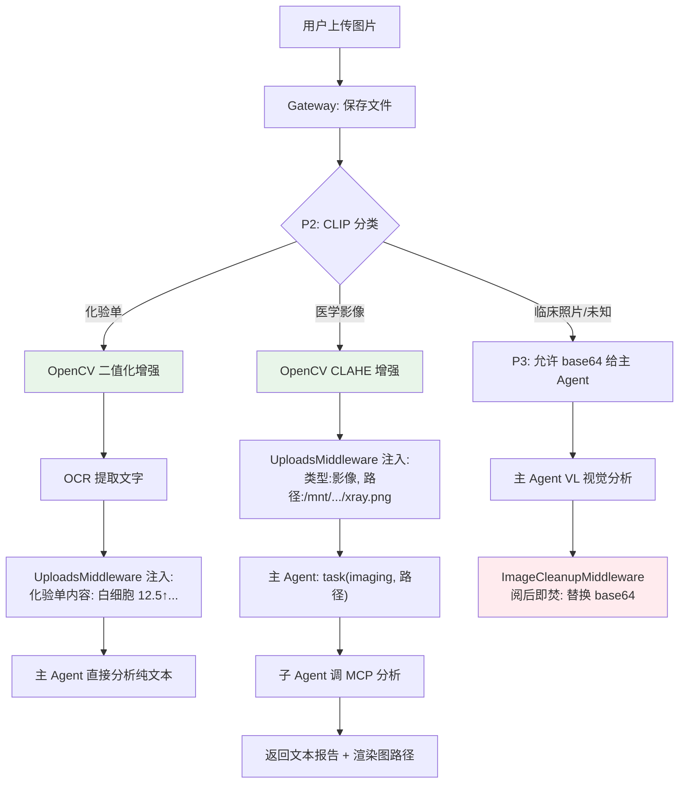

# 医疗多智能体终极架构 — 实施方案

四阶段渐进实施：P0 立即止血 → P1 纯文本管道 → P2 视觉网关 → P3 兜底+清理

> [!CAUTION]
> **已修正的 3 个盲点：**
> 1. 轨道 C 悖论：P0 删了 ViewImageMiddleware 后 base64 无来源。P3 新增 `ConditionalVisionMiddleware`，仅对 `image_type=="临床照片"` 注入 base64
> 2. 异步阻塞：P2 CLIP/OpenCV 是 CPU 密集型同步操作，在 async 路由中必须用 `asyncio.to_thread()` 包装
> 3. 阅后即焚持久化：P3 `ImageCleanupMiddleware` 使用 `Command` 返回确保 Checkpointer 正确写入

---

## P0：立即止血（改 config + 删中间件）

> 目标：关闭 SummarizationMiddleware + 移除 ViewImageMiddleware，消除 base64 对上下文的污染

---

### [MODIFY] [config.yaml](file:///e:/Dev_Workspace/01_Projects/Special/med-agent/1_core_orchestrator/config.yaml)

```diff
 summarization:
-  enabled: true
+  enabled: false
```

> [!NOTE]
> P3 完成"阅后即焚"后可重新开启

---

### [MODIFY] [agent.py](file:///e:/Dev_Workspace/01_Projects/Special/med-agent/1_core_orchestrator/backend/packages/harness/deerflow/agents/lead_agent/agent.py)

L236-241：删除主 Agent 的 ViewImageMiddleware 注入

```diff
-    # Add ViewImageMiddleware only if the current model supports vision.
-    # Use the resolved runtime model_name from make_lead_agent to avoid stale config values.
-    app_config = get_app_config()
-    model_config = app_config.get_model_config(model_name) if model_name else None
-    if model_config is not None and model_config.supports_vision:
-        middlewares.append(ViewImageMiddleware())
```

> `supports_vision: true` 保留——仅用于轨道 C 兜底（P3 实现），但 **不再注入 ViewImageMiddleware**

---

### [MODIFY] [executor.py](file:///e:/Dev_Workspace/01_Projects/Special/med-agent/1_core_orchestrator/backend/packages/harness/deerflow/subagents/executor.py)

L170-174：删除子 Agent 的 ViewImageMiddleware

```diff
-        from deerflow.agents.middlewares.view_image_middleware import ViewImageMiddleware
         middlewares = build_subagent_runtime_middlewares(lazy_init=True)
-        # Add ViewImageMiddleware so sub-agents can see images via view_image tool
-        middlewares.append(ViewImageMiddleware())
```

---

### [MODIFY] [tool_error_handling_middleware.py](file:///e:/Dev_Workspace/01_Projects/Special/med-agent/1_core_orchestrator/backend/packages/harness/deerflow/agents/middlewares/tool_error_handling_middleware.py)

L134：子 Agent 不再需要 UploadsMiddleware（路径通过 task prompt 传递）

```diff
 def build_subagent_runtime_middlewares(...):
     return _build_runtime_middlewares(
-        include_uploads=True,
+        include_uploads=False,
```

---

## P1：纯文本路径管道（重构影像子 Agent）

> 目标：子 Agent 只收路径文本，调 MCP 分析影像，不接触任何图片二进制数据

---

### [MODIFY] [imaging.py](file:///e:/Dev_Workspace/01_Projects/Special/med-agent/1_core_orchestrator/backend/packages/harness/deerflow/subagents/builtins/imaging.py)

```python
IMAGING_CONFIG = SubagentConfig(
    name="imaging",
    description="医学影像解读专家（CT/MRI/X光）",
    system_prompt="""你是 MedAgent 影像科 AI。

## 工作流
1. 从任务描述中提取图片路径（如 /mnt/user-data/uploads/xxx.png）
2. 调用 `chest_xray_analysis` 工具，传入该路径
3. 整理 MCP 返回的结构化报告，输出：
   - 影像类型与部位
   - 异常/病灶描述（位置、大小、形态）
   - 影像学印象
4. 如有处理后图片，用 Markdown 嵌入：

## 约束
- 只做影像解读，不做最终临床诊断
- 报告末尾注明"仅供参考，需影像科医师确认"
- 绝不写伪代码标签如 <read_file>""",
    tools=["chest_xray_analysis"],     # 移除 view_image
    disallowed_tools=["task"],
    model="inherit",                    # 继承主模型，不再需要 VL
    max_turns=10,
)
```

---

### [MODIFY] [prompt.py](file:///e:/Dev_Workspace/01_Projects/Special/med-agent/1_core_orchestrator/backend/packages/harness/deerflow/agents/lead_agent/prompt.py)

#### 改动 1：[_build_subagent_section()](file:///e:/Dev_Workspace/01_Projects/Special/med-agent/1_core_orchestrator/backend/packages/harness/deerflow/agents/lead_agent/prompt.py#7-39) L33-36 示例

```diff
 **示例：**
 ```python
-task(description="分析胸部X光片", prompt="请分析这张胸部X光片: /path", subagent_type="imaging")
-task(description="分析头颅CT", prompt="请分析这张头颅CT: /path", subagent_type="imaging")
+# 从 <uploaded_files> 中提取路径，以纯文本传给子 Agent
+task(description="分析胸部X光", prompt="请分析影像: /mnt/user-data/uploads/chest.png", subagent_type="imaging")
+task(description="分析头颅CT", prompt="请分析影像: /mnt/user-data/uploads/head_ct.png", subagent_type="imaging")
 ```
```

#### 改动 2：`<clinical_routing_rules>` L49-53

```diff
 <clinical_routing_rules>
 ## 编排规则
-1. **影像图像的区分与处理（极其重要！）**：你作为主中枢，具有视觉能力。当你看到用户发送的图片时，请首先判断它是什么类型的图片：
-   - **如果是医学影像扫描图（如 CT、MRI、X光片、超声图等黑白大体解剖图）**：**禁止自己分析**。你只被允许使用 `task` 工具，将其作为任务委派给专业的 `imaging` 子 Agent 来处理（如输入 prompt = "请帮我分析这张胸部X光片: /path/to/img"）。
-   - **如果是化验单、验血报告、体检表等带有文字的检测报告照片**：**由你自己直接处理**。你可以凭借自己的视觉能力读取上面的表格和数值数据，不需要使用子 Agent。
+1. **图片处理规则**：你无法直接看到图片。`<uploaded_files>` 会告诉你文件名和路径。
+   - **医学影像**（X光/CT/MRI，通常文件名含 xray/ct/mri 或用户描述为影像）：
+     提取路径，用 `task(prompt="分析影像: /mnt/.../xxx.png", subagent_type="imaging")` 委派。
+   - **化验单/验血报告**（通常文件名含 report/化验/blood 或用户描述为化验单）：
+     告知用户化验单分析功能正在接入中（P2 阶段 OCR 服务就绪后启用）。
+   - **无法判断类型**：调用 `ask_clarification` 让用户说明图片内容。
```

---

## P2：视觉网关 + CV增强 + OCR轨道

> 目标：图片上传后自动分类 → 增强 → 化验单走 OCR，影像走 MCP

---

### [NEW] [vision_gateway.py](file:///e:/Dev_Workspace/01_Projects/Special/med-agent/1_core_orchestrator/backend/app/gateway/services/vision_gateway.py)

CLIP 零样本分类 + OpenCV 预处理服务

```python
"""Vision Gateway: CLIP classification + OpenCV enhancement."""
import cv2
import numpy as np
from pathlib import Path
from transformers import pipeline

# 单例加载 CLIP（启动时 ~2s，推理 ~50ms）
_classifier = None
LABELS = ["医疗检验报告单据", "医学影像胶片", "普通临床症状照片"]

def get_classifier():
    global _classifier
    if _classifier is None:
        _classifier = pipeline(
            "zero-shot-image-classification",
            model="openai/clip-vit-base-patch32"
        )
    return _classifier

def classify_image(image_path: str) -> dict:
    """返回 {"label": str, "confidence": float}"""
    results = get_classifier()(image_path, candidate_labels=LABELS)
    return {"label": results[0]["label"], "confidence": results[0]["score"]}

def enhance_lab_report(image_path: str, output_path: str):
    """化验单增强：去噪 + 自适应二值化"""
    img = cv2.imread(image_path, cv2.IMREAD_GRAYSCALE)
    denoised = cv2.fastNlMeansDenoising(img, h=10)
    binary = cv2.adaptiveThreshold(
        denoised, 255, cv2.ADAPTIVE_THRESH_GAUSSIAN_C,
        cv2.THRESH_BINARY, 11, 2
    )
    cv2.imwrite(output_path, binary)

def enhance_xray(image_path: str, output_path: str):
    """X光增强：CLAHE 对比度均衡"""
    img = cv2.imread(image_path, cv2.IMREAD_GRAYSCALE)
    clahe = cv2.createCLAHE(clipLimit=2.0, tileGridSize=(8, 8))
    enhanced = clahe.apply(img)
    cv2.imwrite(output_path, enhanced)

def enhance_ct(image_path: str, output_path: str):
    """CT增强：窗位窗宽 + 伪彩色"""
    img = cv2.imread(image_path, cv2.IMREAD_GRAYSCALE)
    colored = cv2.applyColorMap(img, cv2.COLORMAP_BONE)
    cv2.imwrite(output_path, colored)
```

---

### [MODIFY] [uploads.py](file:///e:/Dev_Workspace/01_Projects/Special/med-agent/1_core_orchestrator/backend/app/gateway/routers/uploads.py)

在 `upload_files` 函数中，图片保存后插入分类 + 增强流程。

> [!WARNING]
> **异步阻塞修正**：CLIP 推理和 OpenCV 处理是 CPU 密集型同步操作，必须用 `asyncio.to_thread()` 包装，否则会卡死 Event Loop。

```diff
+import asyncio
+from app.gateway.services.vision_gateway import (
+    classify_image, enhance_lab_report, enhance_xray, enhance_ct
+)

 async def upload_files(...):
     ...
     for file in files:
         file_path = uploads_dir / safe_filename
         ...
+        IMAGE_EXTS = {".png", ".jpg", ".jpeg", ".webp"}
+        if Path(safe_filename).suffix.lower() in IMAGE_EXTS:
+            # ⚠️ CPU 密集操作，必须放线程池
+            classification = await asyncio.to_thread(classify_image, str(file_path))
+            file_info["image_type"] = classification["label"]
+            file_info["image_confidence"] = classification["confidence"]
+
+            enhanced_name = f"enhanced_{safe_filename}"
+            outputs_dir = get_paths().sandbox_outputs_dir(thread_id)
+            outputs_dir.mkdir(parents=True, exist_ok=True)
+            enhanced_path = str(outputs_dir / enhanced_name)
+
+            if classification["label"] == "医疗检验报告单据":
+                await asyncio.to_thread(enhance_lab_report, str(file_path), enhanced_path)
+            elif classification["label"] == "医学影像胶片":
+                await asyncio.to_thread(enhance_xray, str(file_path), enhanced_path)
+            else:
+                enhanced_path = None
+
+            if enhanced_path:
+                file_info["enhanced_path"] = f"/mnt/user-data/outputs/{enhanced_name}"
```

---

### [NEW] [ocr_service.py](file:///e:/Dev_Workspace/01_Projects/Special/med-agent/1_core_orchestrator/backend/app/gateway/services/ocr_service.py)

化验单 OCR 提取服务（使用 PaddleOCR 或 API）：

```python
"""OCR service for lab report text extraction."""
# 方案 A：本地 PaddleOCR
# from paddleocr import PaddleOCR
# ocr = PaddleOCR(use_angle_cls=True, lang='ch')

# 方案 B：调用外部 OCR API（推荐先用这个快速验证）
import httpx

async def extract_lab_report(image_path: str) -> dict:
    """提取化验单结构化数据"""
    # TODO: 接入真实 OCR 服务
    # 返回格式示例：
    return {
        "raw_text": "...",
        "structured": [
            {"name": "白细胞", "value": "12.5", "unit": "×10⁹/L",
             "range": "3.5-9.5", "abnormal": "↑"}
        ]
    }
```

---

### [MODIFY] [uploads_middleware.py](file:///e:/Dev_Workspace/01_Projects/Special/med-agent/1_core_orchestrator/backend/packages/harness/deerflow/agents/middlewares/uploads_middleware.py)

利用上传时附带的 `image_type` 字段，在注入文本时加上分类信息：

```diff
 def _create_files_message(self, new_files, historical_files):
     ...
     for file in new_files:
         lines.append(f"- {file['filename']} ({size_str})")
         lines.append(f"  Path: {file['path']}")
+        if file.get("image_type"):
+            lines.append(f"  类型: {file['image_type']}")
+        if file.get("enhanced_path"):
+            lines.append(f"  增强版: {file['enhanced_path']}")
+        if file.get("ocr_text"):
+            lines.append(f"  化验单内容: {file['ocr_text']}")
```

---

## P3：视觉兜底 + 阅后即焚

> 目标：普通临床照片允许 VL 直接看（base64），但看完立即清理

---

### [NEW] [conditional_vision_middleware.py](file:///e:/Dev_Workspace/01_Projects/Special/med-agent/1_core_orchestrator/backend/packages/harness/deerflow/agents/middlewares/conditional_vision_middleware.py)

> [!IMPORTANT]
> **解决轨道 C 悖论**：P0 删除了全局 ViewImageMiddleware 后，base64 无来源。此中间件**仅对 `image_type=="普通临床症状照片"` 的图片**注入 base64，其他类型一律跳过。

```python
"""Conditional vision middleware - only injects base64 for clinical photos."""
import base64, mimetypes
from pathlib import Path
from langchain.agents import AgentState
from langchain.agents.middleware import AgentMiddleware
from langchain_core.messages import HumanMessage
from langgraph.runtime import Runtime
from deerflow.sandbox.tools import replace_virtual_path, get_thread_data_from_state

class ConditionalVisionMiddleware(AgentMiddleware[AgentState]):
    """Only inject base64 image_url for 'clinical photo' type images.
    Other types (lab reports, medical scans) are handled by OCR/MCP."""

    def _inject(self, state):
        uploaded_files = state.get("uploaded_files") or []
        # 只对 "普通临床症状照片" 注入 base64
        clinical_photos = [
            f for f in uploaded_files
            if f.get("image_type") == "普通临床症状照片"
        ]
        if not clinical_photos:
            return None

        content_blocks = [{"type": "text", "text": "以下是用户上传的临床照片："}]
        for f in clinical_photos:
            actual_path = replace_virtual_path(f["path"], ...)
            path = Path(actual_path)
            if not path.exists():
                continue
            mime, _ = mimetypes.guess_type(str(path))
            with open(path, "rb") as fh:
                b64 = base64.b64encode(fh.read()).decode()
            content_blocks.append({
                "type": "image_url",
                "image_url": {"url": f"data:{mime};base64,{b64}"}
            })

        if len(content_blocks) <= 1:
            return None
        return {"messages": [HumanMessage(content=content_blocks)]}

    def before_model(self, state, runtime: Runtime):
        return self._inject(state)

    async def abefore_model(self, state, runtime: Runtime):
        return self._inject(state)
```

---

### [NEW] [image_cleanup_middleware.py](file:///e:/Dev_Workspace/01_Projects/Special/med-agent/1_core_orchestrator/backend/packages/harness/deerflow/agents/middlewares/image_cleanup_middleware.py)

"阅后即焚"中间件。

> [!IMPORTANT]
> **持久化修正**：使用 `Command(update={"messages": ...})` 返回而非直接 return dict，确保 LangGraph 的 Checkpointer 正确 merge 写入。测试时必须跑 2-3 轮对话，检查第二轮发给 LLM 的 payload 中 base64 是否真的被替换。

```python
"""Burn-after-reading: clean base64 from history after LLM has seen it."""
from langchain.agents import AgentState
from langchain.agents.middleware import AgentMiddleware
from langchain_core.messages import HumanMessage
from langgraph.runtime import Runtime

class ImageCleanupMiddleware(AgentMiddleware[AgentState]):
    """Replace base64 image_url blocks with text placeholders after LLM reads them."""

    def _cleanup(self, state):
        messages = list(state.get("messages", []))
        cleaned = []
        changed = False
        for msg in messages:
            if isinstance(msg, HumanMessage) and isinstance(msg.content, list):
                new_content = []
                for block in msg.content:
                    if isinstance(block, dict) and block.get("type") == "image_url":
                        new_content.append({
                            "type": "text",
                            "text": "[已分析的临床照片 — 图片数据已清理]"
                        })
                        changed = True
                    else:
                        new_content.append(block)
                cleaned.append(HumanMessage(
                    content=new_content, id=msg.id,
                    additional_kwargs=msg.additional_kwargs,
                ))
            else:
                cleaned.append(msg)
        # 返回完整的 messages 列表，让框架的 reducer 正确 merge
        return {"messages": cleaned} if changed else None

    def after_model(self, state, runtime: Runtime):
        return self._cleanup(state)

    async def aafter_model(self, state, runtime: Runtime):
        return self._cleanup(state)
```

---

### [MODIFY] [agent.py](file:///e:/Dev_Workspace/01_Projects/Special/med-agent/1_core_orchestrator/backend/packages/harness/deerflow/agents/lead_agent/agent.py)

在 middleware 链中加入两个新中间件（顺序很重要）：

```diff
+    from deerflow.agents.middlewares.conditional_vision_middleware import ConditionalVisionMiddleware
+    from deerflow.agents.middlewares.image_cleanup_middleware import ImageCleanupMiddleware
+
+    # ConditionalVisionMiddleware 在 before_model 阶段：仅对临床照片注入 base64
+    middlewares.append(ConditionalVisionMiddleware())
+    # ImageCleanupMiddleware 在 after_model 阶段：阅后即焚，清理 base64
+    middlewares.append(ImageCleanupMiddleware())
```

中间件执行顺序：
```
before_model: ... → ConditionalVisionMiddleware（注入临床照片 base64）→ LLM 调用
after_model:  LLM 返回 → ImageCleanupMiddleware（替换 base64 为占位符）→ ...
```

---

### [MODIFY] [config.yaml](file:///e:/Dev_Workspace/01_Projects/Special/med-agent/1_core_orchestrator/config.yaml)

P3 完成后，安全重新开启 summarization：

```diff
 summarization:
-  enabled: false
+  enabled: true
```

---

## 数据流全景图



---

## 实施优先级 & 工期预估

| 阶段 | 范围 | 改动量 | 预估 |
|---|---|---|---|
| **P0** | 关 Summarization + 删 ViewImageMiddleware | 4 文件，~15 行 | **30 分钟** |
| **P1** | 重构 imaging 子 Agent + 更新提示词 | 3 文件，~40 行 | **1 小时** |
| **P2** | CLIP 网关 + OpenCV + OCR 占位 | 3 新文件 + 2 改动 | **半天** |
| **P3** | ImageCleanupMiddleware + 重开 Summarization | 1 新文件 + 2 改动 | **1 小时** |

> [!IMPORTANT]
> **P0 + P1 可以立即执行**，不依赖任何外部服务。
> P2 依赖 `transformers` + `opencv-python-headless` 安装。
> P3 可以和 P2 并行开发。
